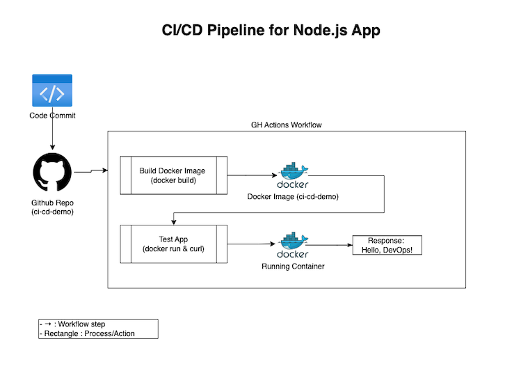

# CI/CD Demo

A simple Node.js app with a GitHub Actions pipeline.

## Setup
1. Install Docker.
2. Build and run locally:
   ```bash
   docker build -t ci-cd-demo .
   docker run -p 3000:3000 ci-cd-demo
   ```
3. Pipeline runs on push to `main`

## Diagram 


